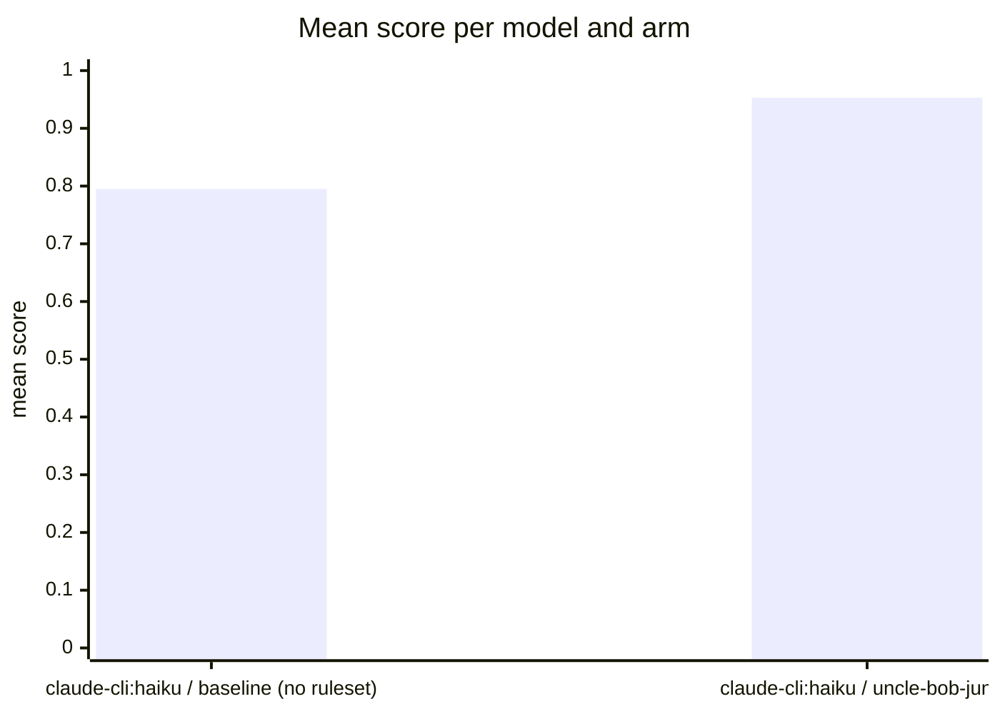

# Benchmark run eval-85H-2026-08-31T11:05:23

Judges: one habit-hooks metric per code smell (0 occurrences = pass;
suggested smells carry half the weight of enforced ones), plus the
valid_code, ships_tests, and correct gates. Higher score = cleaner.
Each smell column holds the occurrence count (enforced smells first,
then suggested). The first table keeps only the smells with at least
one hit across the run; the second carries the full catch list. File
and line locations live in the `habit-hooks/` reports next to this
file; the generated code sits in `src/`.

## Smells with hits

| task | model | arm | score | valid code | habit-hooks | oversized-function | too-many-parameters | high-complexity | oversized-file | unused-variable | unused-import | swallowed-exception | ships tests | correct |
| --- | --- | --- | ---: | :---: | :---: | ---: | ---: | ---: | ---: | ---: | ---: | ---: | :---: | :---: |
| email | claude-cli:haiku | baseline (no ruleset) | 0.88 | YES | PASS | 0 | 0 | 0 | 0 | 0 | 0 | 0 | NO | YES |
| email | claude-cli:haiku | uncle-bob-junior | 1.00 | YES | PASS | 0 | 0 | 0 | 0 | 0 | 0 | 0 | YES | YES |
| email | claude-cli:haiku | baseline (no ruleset) | 0.88 | YES | PASS | 0 | 0 | 0 | 0 | 0 | 0 | 0 | NO | YES |
| email | claude-cli:haiku | uncle-bob-junior | 1.00 | YES | PASS | 0 | 0 | 0 | 0 | 0 | 0 | 0 | YES | YES |
| email | claude-cli:haiku | baseline (no ruleset) | 0.86 | YES | FAIL | 0 | 0 | 0 | 0 | 0 | 1 | 0 | NO | YES |
| email | claude-cli:haiku | uncle-bob-junior | 1.00 | YES | PASS | 0 | 0 | 0 | 0 | 0 | 0 | 0 | YES | YES |
| csv | claude-cli:haiku | baseline (no ruleset) | 0.85 | YES | FAIL | 1 | 0 | 0 | 0 | 0 | 0 | 1 | NO | YES |
| csv | claude-cli:haiku | uncle-bob-junior | 1.00 | YES | PASS | 0 | 0 | 0 | 0 | 0 | 0 | 0 | YES | YES |
| csv | claude-cli:haiku | baseline (no ruleset) | 0.86 | YES | FAIL | 1 | 0 | 0 | 0 | 0 | 0 | 0 | NO | YES |
| csv | claude-cli:haiku | uncle-bob-junior | 1.00 | YES | PASS | 0 | 0 | 0 | 0 | 0 | 0 | 0 | YES | YES |
| csv | claude-cli:haiku | baseline (no ruleset) | 0.86 | YES | FAIL | 1 | 0 | 0 | 0 | 0 | 0 | 0 | NO | YES |
| csv | claude-cli:haiku | uncle-bob-junior | 1.00 | YES | PASS | 0 | 0 | 0 | 0 | 0 | 0 | 0 | YES | YES |
| retry | claude-cli:haiku | baseline (no ruleset) | 0.88 | YES | PASS | 0 | 0 | 0 | 0 | 0 | 0 | 0 | NO | YES |
| retry | claude-cli:haiku | uncle-bob-junior | 1.00 | YES | PASS | 0 | 0 | 0 | 0 | 0 | 0 | 0 | YES | YES |
| retry | claude-cli:haiku | baseline (no ruleset) | 0.88 | YES | PASS | 0 | 0 | 0 | 0 | 0 | 0 | 0 | NO | YES |
| retry | claude-cli:haiku | uncle-bob-junior | 1.00 | YES | PASS | 0 | 0 | 0 | 0 | 0 | 0 | 0 | YES | YES |
| retry | claude-cli:haiku | baseline (no ruleset) | 0.88 | YES | PASS | 0 | 0 | 0 | 0 | 0 | 0 | 0 | NO | YES |
| retry | claude-cli:haiku | uncle-bob-junior | 1.00 | YES | PASS | 0 | 0 | 0 | 0 | 0 | 0 | 0 | YES | YES |
| ratelimit | claude-cli:haiku | baseline (no ruleset) | 0.84 | YES | FAIL | 1 | 0 | 0 | 0 | 0 | 1 | 0 | NO | YES |
| ratelimit | claude-cli:haiku | uncle-bob-junior | 1.00 | YES | PASS | 0 | 0 | 0 | 0 | 0 | 0 | 0 | YES | YES |
| ratelimit | claude-cli:haiku | baseline (no ruleset) | 0.86 | YES | FAIL | 1 | 0 | 0 | 0 | 0 | 0 | 0 | NO | YES |
| ratelimit | claude-cli:haiku | uncle-bob-junior | 1.00 | YES | PASS | 0 | 0 | 0 | 0 | 0 | 0 | 0 | YES | YES |
| ratelimit | claude-cli:haiku | baseline (no ruleset) | 0.83 | YES | FAIL | 1 | 0 | 0 | 0 | 0 | 2 | 0 | NO | YES |
| ratelimit | claude-cli:haiku | uncle-bob-junior | 1.00 | YES | PASS | 0 | 0 | 0 | 0 | 0 | 0 | 0 | YES | YES |
| order | claude-cli:haiku | baseline (no ruleset) | 0.84 | YES | FAIL | 1 | 0 | 0 | 0 | 0 | 1 | 0 | NO | YES |
| order | claude-cli:haiku | uncle-bob-junior | 0.98 | YES | FAIL | 1 | 0 | 0 | 0 | 0 | 0 | 0 | YES | YES |
| order | claude-cli:haiku | baseline (no ruleset) | 0.86 | YES | FAIL | 1 | 0 | 0 | 0 | 0 | 0 | 0 | NO | YES |
| order | claude-cli:haiku | uncle-bob-junior | 0.86 | YES | FAIL | 1 | 0 | 0 | 0 | 0 | 0 | 0 | YES | NO |
| order | claude-cli:haiku | baseline (no ruleset) | 0.83 | YES | FAIL | 1 | 1 | 1 | 0 | 0 | 0 | 0 | NO | YES |
| order | claude-cli:haiku | uncle-bob-junior | 1.00 | YES | PASS | 0 | 0 | 0 | 0 | 0 | 0 | 0 | YES | YES |
| statement | claude-cli:haiku | baseline (no ruleset) | 0.83 | YES | FAIL | 1 | 1 | 1 | 0 | 0 | 0 | 0 | NO | YES |
| statement | claude-cli:haiku | uncle-bob-junior | 0.97 | YES | FAIL | 0 | 1 | 0 | 1 | 0 | 0 | 0 | YES | YES |
| statement | claude-cli:haiku | baseline (no ruleset) | 0.67 | YES | FAIL | 3 | 1 | 1 | 0 | 0 | 0 | 0 | NO | NO |
| statement | claude-cli:haiku | uncle-bob-junior | 0.97 | YES | FAIL | 0 | 1 | 0 | 1 | 0 | 0 | 0 | YES | YES |
| statement | claude-cli:haiku | baseline (no ruleset) | 0.70 | YES | FAIL | 1 | 1 | 1 | 0 | 0 | 0 | 0 | NO | NO |
| statement | claude-cli:haiku | uncle-bob-junior | 0.95 | YES | FAIL | 2 | 1 | 0 | 0 | 0 | 0 | 0 | YES | YES |
| booking | claude-cli:haiku | baseline (no ruleset) | 0.83 | YES | FAIL | 2 | 1 | 0 | 0 | 0 | 0 | 0 | NO | YES |
| booking | claude-cli:haiku | uncle-bob-junior | 0.95 | YES | FAIL | 0 | 1 | 0 | 1 | 0 | 1 | 0 | YES | YES |
| booking | claude-cli:haiku | baseline (no ruleset) | 0.78 | YES | FAIL | 3 | 3 | 0 | 0 | 0 | 0 | 0 | NO | YES |
| booking | claude-cli:haiku | uncle-bob-junior | 0.97 | YES | FAIL | 0 | 2 | 0 | 0 | 0 | 0 | 0 | YES | YES |
| booking | claude-cli:haiku | baseline (no ruleset) | 0.77 | YES | FAIL | 4 | 1 | 0 | 0 | 1 | 0 | 1 | NO | YES |
| booking | claude-cli:haiku | uncle-bob-junior | 0.97 | YES | FAIL | 1 | 1 | 0 | 0 | 0 | 0 | 0 | YES | YES |
| config | claude-cli:haiku | baseline (no ruleset) | 0.81 | YES | FAIL | 2 | 0 | 1 | 0 | 1 | 0 | 0 | NO | YES |
| config | claude-cli:haiku | uncle-bob-junior | 0.92 | YES | FAIL | 1 | 6 | 0 | 0 | 0 | 0 | 0 | YES | YES |
| config | claude-cli:haiku | baseline (no ruleset) | 0.67 | YES | FAIL | 3 | 0 | 1 | 1 | 0 | 0 | 0 | NO | NO |
| config | claude-cli:haiku | uncle-bob-junior | 0.95 | YES | FAIL | 1 | 2 | 0 | 0 | 0 | 0 | 0 | YES | YES |
| config | claude-cli:haiku | baseline (no ruleset) | 0.83 | YES | FAIL | 1 | 0 | 1 | 1 | 0 | 0 | 0 | NO | YES |
| config | claude-cli:haiku | uncle-bob-junior | 0.94 | YES | FAIL | 2 | 2 | 0 | 0 | 0 | 0 | 0 | YES | YES |
| logscan | claude-cli:haiku | baseline (no ruleset) | 0.70 | YES | FAIL | 2 | 1 | 0 | 0 | 0 | 0 | 0 | NO | NO |
| logscan | claude-cli:haiku | uncle-bob-junior | 0.84 | YES | FAIL | 1 | 1 | 0 | 0 | 0 | 0 | 0 | YES | NO |
| logscan | claude-cli:haiku | baseline (no ruleset) | 0.68 | YES | FAIL | 3 | 1 | 0 | 0 | 0 | 0 | 1 | NO | NO |
| logscan | claude-cli:haiku | uncle-bob-junior | 0.84 | YES | FAIL | 0 | 1 | 0 | 1 | 0 | 0 | 0 | YES | NO |
| logscan | claude-cli:haiku | baseline (no ruleset) | 0.72 | YES | FAIL | 2 | 0 | 0 | 0 | 0 | 0 | 0 | NO | NO |
| logscan | claude-cli:haiku | uncle-bob-junior | 0.83 | YES | FAIL | 1 | 2 | 0 | 0 | 0 | 0 | 0 | YES | NO |
| expense | claude-cli:haiku | baseline (no ruleset) | 0.66 | YES | FAIL | 4 | 1 | 0 | 1 | 0 | 0 | 0 | NO | NO |
| expense | claude-cli:haiku | uncle-bob-junior | 0.80 | YES | FAIL | 1 | 2 | 0 | 0 | 0 | 2 | 0 | YES | NO |
| expense | claude-cli:haiku | baseline (no ruleset) | 0.69 | YES | FAIL | 3 | 1 | 0 | 0 | 0 | 0 | 0 | NO | NO |
| expense | claude-cli:haiku | uncle-bob-junior | 1.00 | YES | PASS | 0 | 0 | 0 | 0 | 0 | 0 | 0 | YES | YES |
| expense | claude-cli:haiku | baseline (no ruleset) | 0.64 | YES | FAIL | 4 | 2 | 1 | 0 | 0 | 0 | 0 | NO | NO |
| expense | claude-cli:haiku | uncle-bob-junior | 0.84 | YES | FAIL | 1 | 0 | 0 | 0 | 0 | 1 | 0 | YES | NO |

## Full smell breakdown

| task | model | arm | score | valid code | habit-hooks | oversized-function | too-many-parameters | high-complexity | deep-nesting | oversized-file | unused-variable | unused-import | loose-equality | var-declaration | non-const-binding | duplicate-import | redundant-type-annotation | unused-class-member | unused-file | unused-export | unused-dependency | test-only-dead-code | parse-error | warning-comment | explicit-any | non-null-assertion | non-essential-comment | duplicated-code | swallowed-exception | ships tests | correct |
| --- | --- | --- | ---: | :---: | :---: | ---: | ---: | ---: | ---: | ---: | ---: | ---: | ---: | ---: | ---: | ---: | ---: | ---: | ---: | ---: | ---: | ---: | ---: | ---: | ---: | ---: | ---: | ---: | ---: | :---: | :---: |
| email | claude-cli:haiku | baseline (no ruleset) | 0.88 | YES | PASS | 0 | 0 | 0 | 0 | 0 | 0 | 0 | 0 | 0 | 0 | 0 | 0 | 0 | 0 | 0 | 0 | 0 | 0 | 0 | 0 | 0 | 0 | 0 | 0 | NO | YES |
| email | claude-cli:haiku | uncle-bob-junior | 1.00 | YES | PASS | 0 | 0 | 0 | 0 | 0 | 0 | 0 | 0 | 0 | 0 | 0 | 0 | 0 | 0 | 0 | 0 | 0 | 0 | 0 | 0 | 0 | 0 | 0 | 0 | YES | YES |
| email | claude-cli:haiku | baseline (no ruleset) | 0.88 | YES | PASS | 0 | 0 | 0 | 0 | 0 | 0 | 0 | 0 | 0 | 0 | 0 | 0 | 0 | 0 | 0 | 0 | 0 | 0 | 0 | 0 | 0 | 0 | 0 | 0 | NO | YES |
| email | claude-cli:haiku | uncle-bob-junior | 1.00 | YES | PASS | 0 | 0 | 0 | 0 | 0 | 0 | 0 | 0 | 0 | 0 | 0 | 0 | 0 | 0 | 0 | 0 | 0 | 0 | 0 | 0 | 0 | 0 | 0 | 0 | YES | YES |
| email | claude-cli:haiku | baseline (no ruleset) | 0.86 | YES | FAIL | 0 | 0 | 0 | 0 | 0 | 0 | 1 | 0 | 0 | 0 | 0 | 0 | 0 | 0 | 0 | 0 | 0 | 0 | 0 | 0 | 0 | 0 | 0 | 0 | NO | YES |
| email | claude-cli:haiku | uncle-bob-junior | 1.00 | YES | PASS | 0 | 0 | 0 | 0 | 0 | 0 | 0 | 0 | 0 | 0 | 0 | 0 | 0 | 0 | 0 | 0 | 0 | 0 | 0 | 0 | 0 | 0 | 0 | 0 | YES | YES |
| csv | claude-cli:haiku | baseline (no ruleset) | 0.85 | YES | FAIL | 1 | 0 | 0 | 0 | 0 | 0 | 0 | 0 | 0 | 0 | 0 | 0 | 0 | 0 | 0 | 0 | 0 | 0 | 0 | 0 | 0 | 0 | 0 | 1 | NO | YES |
| csv | claude-cli:haiku | uncle-bob-junior | 1.00 | YES | PASS | 0 | 0 | 0 | 0 | 0 | 0 | 0 | 0 | 0 | 0 | 0 | 0 | 0 | 0 | 0 | 0 | 0 | 0 | 0 | 0 | 0 | 0 | 0 | 0 | YES | YES |
| csv | claude-cli:haiku | baseline (no ruleset) | 0.86 | YES | FAIL | 1 | 0 | 0 | 0 | 0 | 0 | 0 | 0 | 0 | 0 | 0 | 0 | 0 | 0 | 0 | 0 | 0 | 0 | 0 | 0 | 0 | 0 | 0 | 0 | NO | YES |
| csv | claude-cli:haiku | uncle-bob-junior | 1.00 | YES | PASS | 0 | 0 | 0 | 0 | 0 | 0 | 0 | 0 | 0 | 0 | 0 | 0 | 0 | 0 | 0 | 0 | 0 | 0 | 0 | 0 | 0 | 0 | 0 | 0 | YES | YES |
| csv | claude-cli:haiku | baseline (no ruleset) | 0.86 | YES | FAIL | 1 | 0 | 0 | 0 | 0 | 0 | 0 | 0 | 0 | 0 | 0 | 0 | 0 | 0 | 0 | 0 | 0 | 0 | 0 | 0 | 0 | 0 | 0 | 0 | NO | YES |
| csv | claude-cli:haiku | uncle-bob-junior | 1.00 | YES | PASS | 0 | 0 | 0 | 0 | 0 | 0 | 0 | 0 | 0 | 0 | 0 | 0 | 0 | 0 | 0 | 0 | 0 | 0 | 0 | 0 | 0 | 0 | 0 | 0 | YES | YES |
| retry | claude-cli:haiku | baseline (no ruleset) | 0.88 | YES | PASS | 0 | 0 | 0 | 0 | 0 | 0 | 0 | 0 | 0 | 0 | 0 | 0 | 0 | 0 | 0 | 0 | 0 | 0 | 0 | 0 | 0 | 0 | 0 | 0 | NO | YES |
| retry | claude-cli:haiku | uncle-bob-junior | 1.00 | YES | PASS | 0 | 0 | 0 | 0 | 0 | 0 | 0 | 0 | 0 | 0 | 0 | 0 | 0 | 0 | 0 | 0 | 0 | 0 | 0 | 0 | 0 | 0 | 0 | 0 | YES | YES |
| retry | claude-cli:haiku | baseline (no ruleset) | 0.88 | YES | PASS | 0 | 0 | 0 | 0 | 0 | 0 | 0 | 0 | 0 | 0 | 0 | 0 | 0 | 0 | 0 | 0 | 0 | 0 | 0 | 0 | 0 | 0 | 0 | 0 | NO | YES |
| retry | claude-cli:haiku | uncle-bob-junior | 1.00 | YES | PASS | 0 | 0 | 0 | 0 | 0 | 0 | 0 | 0 | 0 | 0 | 0 | 0 | 0 | 0 | 0 | 0 | 0 | 0 | 0 | 0 | 0 | 0 | 0 | 0 | YES | YES |
| retry | claude-cli:haiku | baseline (no ruleset) | 0.88 | YES | PASS | 0 | 0 | 0 | 0 | 0 | 0 | 0 | 0 | 0 | 0 | 0 | 0 | 0 | 0 | 0 | 0 | 0 | 0 | 0 | 0 | 0 | 0 | 0 | 0 | NO | YES |
| retry | claude-cli:haiku | uncle-bob-junior | 1.00 | YES | PASS | 0 | 0 | 0 | 0 | 0 | 0 | 0 | 0 | 0 | 0 | 0 | 0 | 0 | 0 | 0 | 0 | 0 | 0 | 0 | 0 | 0 | 0 | 0 | 0 | YES | YES |
| ratelimit | claude-cli:haiku | baseline (no ruleset) | 0.84 | YES | FAIL | 1 | 0 | 0 | 0 | 0 | 0 | 1 | 0 | 0 | 0 | 0 | 0 | 0 | 0 | 0 | 0 | 0 | 0 | 0 | 0 | 0 | 0 | 0 | 0 | NO | YES |
| ratelimit | claude-cli:haiku | uncle-bob-junior | 1.00 | YES | PASS | 0 | 0 | 0 | 0 | 0 | 0 | 0 | 0 | 0 | 0 | 0 | 0 | 0 | 0 | 0 | 0 | 0 | 0 | 0 | 0 | 0 | 0 | 0 | 0 | YES | YES |
| ratelimit | claude-cli:haiku | baseline (no ruleset) | 0.86 | YES | FAIL | 1 | 0 | 0 | 0 | 0 | 0 | 0 | 0 | 0 | 0 | 0 | 0 | 0 | 0 | 0 | 0 | 0 | 0 | 0 | 0 | 0 | 0 | 0 | 0 | NO | YES |
| ratelimit | claude-cli:haiku | uncle-bob-junior | 1.00 | YES | PASS | 0 | 0 | 0 | 0 | 0 | 0 | 0 | 0 | 0 | 0 | 0 | 0 | 0 | 0 | 0 | 0 | 0 | 0 | 0 | 0 | 0 | 0 | 0 | 0 | YES | YES |
| ratelimit | claude-cli:haiku | baseline (no ruleset) | 0.83 | YES | FAIL | 1 | 0 | 0 | 0 | 0 | 0 | 2 | 0 | 0 | 0 | 0 | 0 | 0 | 0 | 0 | 0 | 0 | 0 | 0 | 0 | 0 | 0 | 0 | 0 | NO | YES |
| ratelimit | claude-cli:haiku | uncle-bob-junior | 1.00 | YES | PASS | 0 | 0 | 0 | 0 | 0 | 0 | 0 | 0 | 0 | 0 | 0 | 0 | 0 | 0 | 0 | 0 | 0 | 0 | 0 | 0 | 0 | 0 | 0 | 0 | YES | YES |
| order | claude-cli:haiku | baseline (no ruleset) | 0.84 | YES | FAIL | 1 | 0 | 0 | 0 | 0 | 0 | 1 | 0 | 0 | 0 | 0 | 0 | 0 | 0 | 0 | 0 | 0 | 0 | 0 | 0 | 0 | 0 | 0 | 0 | NO | YES |
| order | claude-cli:haiku | uncle-bob-junior | 0.98 | YES | FAIL | 1 | 0 | 0 | 0 | 0 | 0 | 0 | 0 | 0 | 0 | 0 | 0 | 0 | 0 | 0 | 0 | 0 | 0 | 0 | 0 | 0 | 0 | 0 | 0 | YES | YES |
| order | claude-cli:haiku | baseline (no ruleset) | 0.86 | YES | FAIL | 1 | 0 | 0 | 0 | 0 | 0 | 0 | 0 | 0 | 0 | 0 | 0 | 0 | 0 | 0 | 0 | 0 | 0 | 0 | 0 | 0 | 0 | 0 | 0 | NO | YES |
| order | claude-cli:haiku | uncle-bob-junior | 0.86 | YES | FAIL | 1 | 0 | 0 | 0 | 0 | 0 | 0 | 0 | 0 | 0 | 0 | 0 | 0 | 0 | 0 | 0 | 0 | 0 | 0 | 0 | 0 | 0 | 0 | 0 | YES | NO |
| order | claude-cli:haiku | baseline (no ruleset) | 0.83 | YES | FAIL | 1 | 1 | 1 | 0 | 0 | 0 | 0 | 0 | 0 | 0 | 0 | 0 | 0 | 0 | 0 | 0 | 0 | 0 | 0 | 0 | 0 | 0 | 0 | 0 | NO | YES |
| order | claude-cli:haiku | uncle-bob-junior | 1.00 | YES | PASS | 0 | 0 | 0 | 0 | 0 | 0 | 0 | 0 | 0 | 0 | 0 | 0 | 0 | 0 | 0 | 0 | 0 | 0 | 0 | 0 | 0 | 0 | 0 | 0 | YES | YES |
| statement | claude-cli:haiku | baseline (no ruleset) | 0.83 | YES | FAIL | 1 | 1 | 1 | 0 | 0 | 0 | 0 | 0 | 0 | 0 | 0 | 0 | 0 | 0 | 0 | 0 | 0 | 0 | 0 | 0 | 0 | 0 | 0 | 0 | NO | YES |
| statement | claude-cli:haiku | uncle-bob-junior | 0.97 | YES | FAIL | 0 | 1 | 0 | 0 | 1 | 0 | 0 | 0 | 0 | 0 | 0 | 0 | 0 | 0 | 0 | 0 | 0 | 0 | 0 | 0 | 0 | 0 | 0 | 0 | YES | YES |
| statement | claude-cli:haiku | baseline (no ruleset) | 0.67 | YES | FAIL | 3 | 1 | 1 | 0 | 0 | 0 | 0 | 0 | 0 | 0 | 0 | 0 | 0 | 0 | 0 | 0 | 0 | 0 | 0 | 0 | 0 | 0 | 0 | 0 | NO | NO |
| statement | claude-cli:haiku | uncle-bob-junior | 0.97 | YES | FAIL | 0 | 1 | 0 | 0 | 1 | 0 | 0 | 0 | 0 | 0 | 0 | 0 | 0 | 0 | 0 | 0 | 0 | 0 | 0 | 0 | 0 | 0 | 0 | 0 | YES | YES |
| statement | claude-cli:haiku | baseline (no ruleset) | 0.70 | YES | FAIL | 1 | 1 | 1 | 0 | 0 | 0 | 0 | 0 | 0 | 0 | 0 | 0 | 0 | 0 | 0 | 0 | 0 | 0 | 0 | 0 | 0 | 0 | 0 | 0 | NO | NO |
| statement | claude-cli:haiku | uncle-bob-junior | 0.95 | YES | FAIL | 2 | 1 | 0 | 0 | 0 | 0 | 0 | 0 | 0 | 0 | 0 | 0 | 0 | 0 | 0 | 0 | 0 | 0 | 0 | 0 | 0 | 0 | 0 | 0 | YES | YES |
| booking | claude-cli:haiku | baseline (no ruleset) | 0.83 | YES | FAIL | 2 | 1 | 0 | 0 | 0 | 0 | 0 | 0 | 0 | 0 | 0 | 0 | 0 | 0 | 0 | 0 | 0 | 0 | 0 | 0 | 0 | 0 | 0 | 0 | NO | YES |
| booking | claude-cli:haiku | uncle-bob-junior | 0.95 | YES | FAIL | 0 | 1 | 0 | 0 | 1 | 0 | 1 | 0 | 0 | 0 | 0 | 0 | 0 | 0 | 0 | 0 | 0 | 0 | 0 | 0 | 0 | 0 | 0 | 0 | YES | YES |
| booking | claude-cli:haiku | baseline (no ruleset) | 0.78 | YES | FAIL | 3 | 3 | 0 | 0 | 0 | 0 | 0 | 0 | 0 | 0 | 0 | 0 | 0 | 0 | 0 | 0 | 0 | 0 | 0 | 0 | 0 | 0 | 0 | 0 | NO | YES |
| booking | claude-cli:haiku | uncle-bob-junior | 0.97 | YES | FAIL | 0 | 2 | 0 | 0 | 0 | 0 | 0 | 0 | 0 | 0 | 0 | 0 | 0 | 0 | 0 | 0 | 0 | 0 | 0 | 0 | 0 | 0 | 0 | 0 | YES | YES |
| booking | claude-cli:haiku | baseline (no ruleset) | 0.77 | YES | FAIL | 4 | 1 | 0 | 0 | 0 | 1 | 0 | 0 | 0 | 0 | 0 | 0 | 0 | 0 | 0 | 0 | 0 | 0 | 0 | 0 | 0 | 0 | 0 | 1 | NO | YES |
| booking | claude-cli:haiku | uncle-bob-junior | 0.97 | YES | FAIL | 1 | 1 | 0 | 0 | 0 | 0 | 0 | 0 | 0 | 0 | 0 | 0 | 0 | 0 | 0 | 0 | 0 | 0 | 0 | 0 | 0 | 0 | 0 | 0 | YES | YES |
| config | claude-cli:haiku | baseline (no ruleset) | 0.81 | YES | FAIL | 2 | 0 | 1 | 0 | 0 | 1 | 0 | 0 | 0 | 0 | 0 | 0 | 0 | 0 | 0 | 0 | 0 | 0 | 0 | 0 | 0 | 0 | 0 | 0 | NO | YES |
| config | claude-cli:haiku | uncle-bob-junior | 0.92 | YES | FAIL | 1 | 6 | 0 | 0 | 0 | 0 | 0 | 0 | 0 | 0 | 0 | 0 | 0 | 0 | 0 | 0 | 0 | 0 | 0 | 0 | 0 | 0 | 0 | 0 | YES | YES |
| config | claude-cli:haiku | baseline (no ruleset) | 0.67 | YES | FAIL | 3 | 0 | 1 | 0 | 1 | 0 | 0 | 0 | 0 | 0 | 0 | 0 | 0 | 0 | 0 | 0 | 0 | 0 | 0 | 0 | 0 | 0 | 0 | 0 | NO | NO |
| config | claude-cli:haiku | uncle-bob-junior | 0.95 | YES | FAIL | 1 | 2 | 0 | 0 | 0 | 0 | 0 | 0 | 0 | 0 | 0 | 0 | 0 | 0 | 0 | 0 | 0 | 0 | 0 | 0 | 0 | 0 | 0 | 0 | YES | YES |
| config | claude-cli:haiku | baseline (no ruleset) | 0.83 | YES | FAIL | 1 | 0 | 1 | 0 | 1 | 0 | 0 | 0 | 0 | 0 | 0 | 0 | 0 | 0 | 0 | 0 | 0 | 0 | 0 | 0 | 0 | 0 | 0 | 0 | NO | YES |
| config | claude-cli:haiku | uncle-bob-junior | 0.94 | YES | FAIL | 2 | 2 | 0 | 0 | 0 | 0 | 0 | 0 | 0 | 0 | 0 | 0 | 0 | 0 | 0 | 0 | 0 | 0 | 0 | 0 | 0 | 0 | 0 | 0 | YES | YES |
| logscan | claude-cli:haiku | baseline (no ruleset) | 0.70 | YES | FAIL | 2 | 1 | 0 | 0 | 0 | 0 | 0 | 0 | 0 | 0 | 0 | 0 | 0 | 0 | 0 | 0 | 0 | 0 | 0 | 0 | 0 | 0 | 0 | 0 | NO | NO |
| logscan | claude-cli:haiku | uncle-bob-junior | 0.84 | YES | FAIL | 1 | 1 | 0 | 0 | 0 | 0 | 0 | 0 | 0 | 0 | 0 | 0 | 0 | 0 | 0 | 0 | 0 | 0 | 0 | 0 | 0 | 0 | 0 | 0 | YES | NO |
| logscan | claude-cli:haiku | baseline (no ruleset) | 0.68 | YES | FAIL | 3 | 1 | 0 | 0 | 0 | 0 | 0 | 0 | 0 | 0 | 0 | 0 | 0 | 0 | 0 | 0 | 0 | 0 | 0 | 0 | 0 | 0 | 0 | 1 | NO | NO |
| logscan | claude-cli:haiku | uncle-bob-junior | 0.84 | YES | FAIL | 0 | 1 | 0 | 0 | 1 | 0 | 0 | 0 | 0 | 0 | 0 | 0 | 0 | 0 | 0 | 0 | 0 | 0 | 0 | 0 | 0 | 0 | 0 | 0 | YES | NO |
| logscan | claude-cli:haiku | baseline (no ruleset) | 0.72 | YES | FAIL | 2 | 0 | 0 | 0 | 0 | 0 | 0 | 0 | 0 | 0 | 0 | 0 | 0 | 0 | 0 | 0 | 0 | 0 | 0 | 0 | 0 | 0 | 0 | 0 | NO | NO |
| logscan | claude-cli:haiku | uncle-bob-junior | 0.83 | YES | FAIL | 1 | 2 | 0 | 0 | 0 | 0 | 0 | 0 | 0 | 0 | 0 | 0 | 0 | 0 | 0 | 0 | 0 | 0 | 0 | 0 | 0 | 0 | 0 | 0 | YES | NO |
| expense | claude-cli:haiku | baseline (no ruleset) | 0.66 | YES | FAIL | 4 | 1 | 0 | 0 | 1 | 0 | 0 | 0 | 0 | 0 | 0 | 0 | 0 | 0 | 0 | 0 | 0 | 0 | 0 | 0 | 0 | 0 | 0 | 0 | NO | NO |
| expense | claude-cli:haiku | uncle-bob-junior | 0.80 | YES | FAIL | 1 | 2 | 0 | 0 | 0 | 0 | 2 | 0 | 0 | 0 | 0 | 0 | 0 | 0 | 0 | 0 | 0 | 0 | 0 | 0 | 0 | 0 | 0 | 0 | YES | NO |
| expense | claude-cli:haiku | baseline (no ruleset) | 0.69 | YES | FAIL | 3 | 1 | 0 | 0 | 0 | 0 | 0 | 0 | 0 | 0 | 0 | 0 | 0 | 0 | 0 | 0 | 0 | 0 | 0 | 0 | 0 | 0 | 0 | 0 | NO | NO |
| expense | claude-cli:haiku | uncle-bob-junior | 1.00 | YES | PASS | 0 | 0 | 0 | 0 | 0 | 0 | 0 | 0 | 0 | 0 | 0 | 0 | 0 | 0 | 0 | 0 | 0 | 0 | 0 | 0 | 0 | 0 | 0 | 0 | YES | YES |
| expense | claude-cli:haiku | baseline (no ruleset) | 0.64 | YES | FAIL | 4 | 2 | 1 | 0 | 0 | 0 | 0 | 0 | 0 | 0 | 0 | 0 | 0 | 0 | 0 | 0 | 0 | 0 | 0 | 0 | 0 | 0 | 0 | 0 | NO | NO |
| expense | claude-cli:haiku | uncle-bob-junior | 0.84 | YES | FAIL | 1 | 0 | 0 | 0 | 0 | 0 | 1 | 0 | 0 | 0 | 0 | 0 | 0 | 0 | 0 | 0 | 0 | 0 | 0 | 0 | 0 | 0 | 0 | 0 | YES | NO |

## Mean score per model and arm

- **claude-cli:haiku / baseline (no ruleset)**: 0.795 (n=30)
- **claude-cli:haiku / uncle-bob-junior**: 0.953 (n=30)

