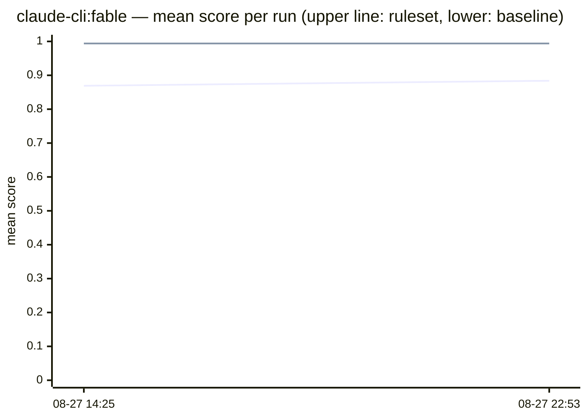
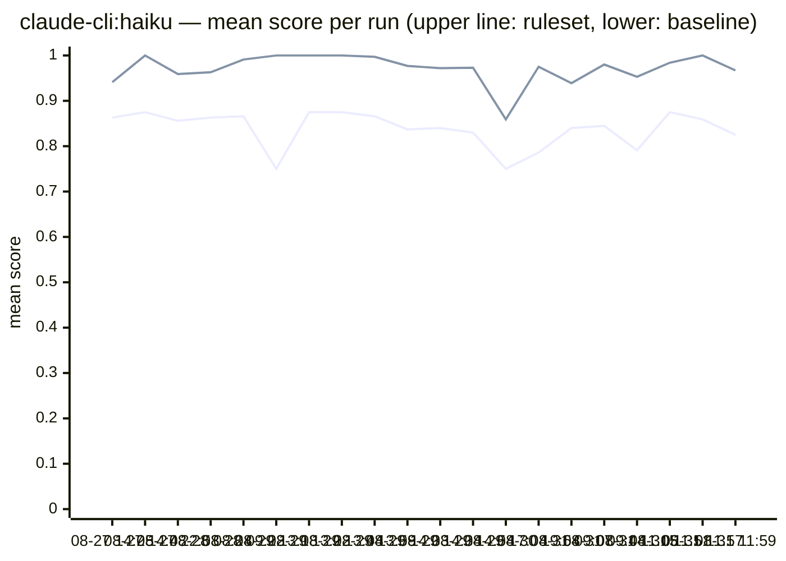
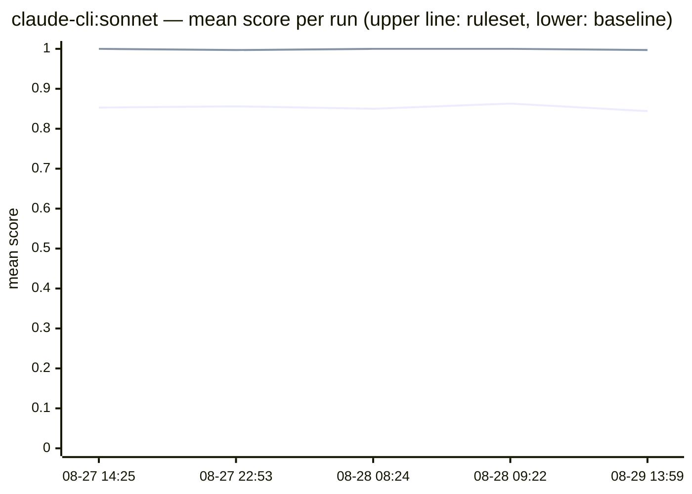

Does the ruleset actually change the code Claude writes? Every stored run
answers with the same experiment: identical tasks, once bare (baseline) and
once with the uncle-bob-junior ruleset as system prompt, judged by
[habit-hooks](https://github.com/habit-hooks/habit-hooks) and correctness
gates — no LLM grading.

## The trend, oldest to newest

Mean score per run and arm. Task sets grew over time (each run's own pages
list its coverage), so read the lines as the arms' gap per run rather than
one continuous series.

### claude-cli&#58;fable

### claude-cli&#58;haiku

### claude-cli&#58;sonnet

## Dig in

<a className="button button--primary" href="methodology">Methodology</a>
<a className="button button--primary" href="scoreboard">Featured scoreboard</a>
<a className="button button--primary" href="history">Past runs</a>
<a className="button button--primary" href="subset">Subset runs</a>

