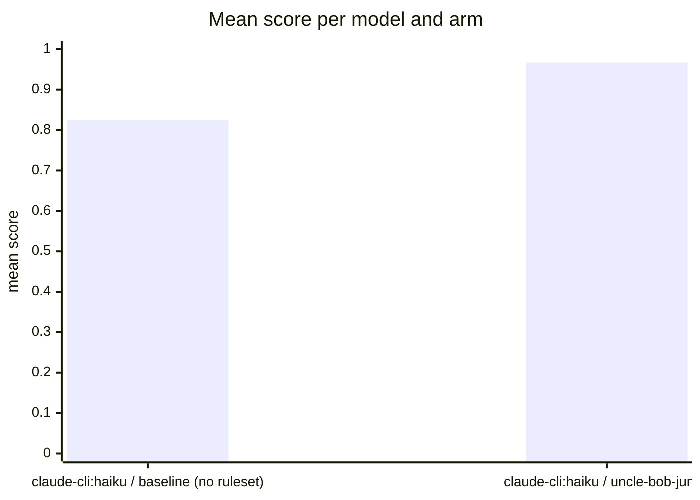

Run `eval-dwH-2026-08-31T11:59:48`: the same tasks and models, once bare (baseline) and once
with the uncle-bob-junior ruleset as system prompt, judged by
[habit-hooks](https://github.com/habit-hooks/habit-hooks) plus valid-code,
ships-tests, and correctness gates. Single-shot generations, so expect
run-to-run variance.

## Mean score per model and arm

## Per task

| Task | Arm | Score | Valid code | Habit-hooks | Ships tests | Correct | Oversized function | Too many parameters | High complexity | Oversized file | Unused variable | Unused import |
|---|---|---:|:---:|:---:|:---:|:---:|---:|---:|---:|---:|---:|---:|
| [booking](booking) | claude-cli:haiku · baseline (no ruleset) | 0.77 | Yes | **Fail** | **No** | Yes | 5 | 2 | 0 | 1 | 0 | 0 |
| [booking](booking) | claude-cli:haiku · uncle-bob-junior | 0.91 | Yes | **Fail** | Yes | Yes | 1 | 6 | 0 | 0 | 1 | 0 |
| [config](config) | claude-cli:haiku · baseline (no ruleset) | 0.81 | Yes | **Fail** | **No** | Yes | 1 | 1 | 2 | 0 | 0 | 0 |
| [config](config) | claude-cli:haiku · uncle-bob-junior | 0.97 | Yes | **Fail** | Yes | Yes | 1 | 1 | 0 | 0 | 0 | 0 |
| [csv](csv) | claude-cli:haiku · baseline (no ruleset) | 0.83 | Yes | **Fail** | **No** | Yes | 1 | 0 | 1 | 0 | 0 | 1 |
| [csv](csv) | claude-cli:haiku · uncle-bob-junior | 0.98 | Yes | **Fail** | Yes | Yes | 1 | 0 | 0 | 0 | 0 | 0 |
| [email](email) | claude-cli:haiku · baseline (no ruleset) | 0.88 | Yes | Pass | **No** | Yes | 0 | 0 | 0 | 0 | 0 | 0 |
| [email](email) | claude-cli:haiku · uncle-bob-junior | 1.00 | Yes | Pass | Yes | Yes | 0 | 0 | 0 | 0 | 0 | 0 |
| [expense](expense) | claude-cli:haiku · baseline (no ruleset) | 0.88 | Yes | Pass | **No** | Yes | 0 | 0 | 0 | 0 | 0 | 0 |
| [expense](expense) | claude-cli:haiku · uncle-bob-junior | 0.88 | Yes | Pass | **No** | Yes | 0 | 0 | 0 | 0 | 0 | 0 |
| [logscan](logscan) | claude-cli:haiku · baseline (no ruleset) | 0.86 | Yes | **Fail** | **No** | Yes | 0 | 0 | 1 | 0 | 0 | 0 |
| [logscan](logscan) | claude-cli:haiku · uncle-bob-junior | 0.98 | Yes | **Fail** | Yes | Yes | 0 | 0 | 0 | 1 | 0 | 0 |
| [order](order) | claude-cli:haiku · baseline (no ruleset) | 0.84 | Yes | **Fail** | **No** | Yes | 1 | 0 | 1 | 0 | 0 | 0 |
| [order](order) | claude-cli:haiku · uncle-bob-junior | 0.98 | Yes | **Fail** | Yes | Yes | 0 | 1 | 0 | 0 | 0 | 0 |
| [ratelimit](ratelimit) | claude-cli:haiku · baseline (no ruleset) | 0.84 | Yes | **Fail** | **No** | Yes | 0 | 0 | 0 | 0 | 0 | 2 |
| [ratelimit](ratelimit) | claude-cli:haiku · uncle-bob-junior | 1.00 | Yes | Pass | Yes | Yes | 0 | 0 | 0 | 0 | 0 | 0 |
| [retry](retry) | claude-cli:haiku · baseline (no ruleset) | 0.86 | Yes | **Fail** | **No** | Yes | 0 | 0 | 0 | 0 | 0 | 1 |
| [retry](retry) | claude-cli:haiku · uncle-bob-junior | 1.00 | Yes | Pass | Yes | Yes | 0 | 0 | 0 | 0 | 0 | 0 |
| [statement](statement) | claude-cli:haiku · baseline (no ruleset) | 0.69 | Yes | **Fail** | **No** | **No** | 2 | 1 | 1 | 0 | 0 | 0 |
| [statement](statement) | claude-cli:haiku · uncle-bob-junior | 0.97 | Yes | **Fail** | Yes | Yes | 1 | 1 | 0 | 0 | 0 | 0 |

Older full runs live under [past runs](history); partial runs under
[subset runs](subset).
