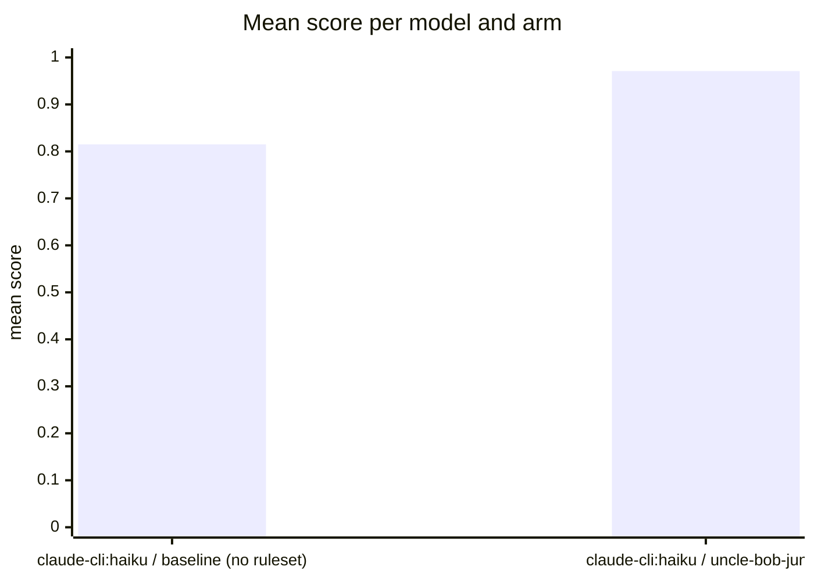

Run `eval-MpG-2026-08-30T19:54:33`: the same tasks and models, once bare (baseline) and once
with the uncle-bob-junior ruleset as system prompt, judged by
[habit-hooks](https://github.com/habit-hooks/habit-hooks) plus valid-code,
ships-tests, and correctness gates. Single-shot generations, so expect
run-to-run variance.

## Mean score per model and arm

## Per task

| task | arm | score | valid code | habit-hooks | ships tests | correct | oversized-function | too-many-parameters | high-complexity | oversized-file | unused-import | swallowed-exception |
|---|---|---:|:---:|:---:|:---:|:---:|---:|---:|---:|---:|---:|---:|
| [email](email) | claude-cli:haiku · baseline (no ruleset) | 0.75 | **NO** | pass | **NO** | yes | 0 | 0 | 0 | 0 | 0 | 0 |
| [email](email) | claude-cli:haiku · uncle-bob-junior | 1.00 | yes | pass | yes | yes | 0 | 0 | 0 | 0 | 0 | 0 |
| [email](email) | claude-cli:haiku · baseline (no ruleset) | 0.88 | yes | pass | **NO** | yes | 0 | 0 | 0 | 0 | 0 | 0 |
| [email](email) | claude-cli:haiku · uncle-bob-junior | 1.00 | yes | pass | yes | yes | 0 | 0 | 0 | 0 | 0 | 0 |
| [email](email) | claude-cli:haiku · baseline (no ruleset) | 0.86 | yes | **FAIL** | **NO** | yes | 1 | 0 | 0 | 0 | 0 | 0 |
| [email](email) | claude-cli:haiku · uncle-bob-junior | 1.00 | yes | pass | yes | yes | 0 | 0 | 0 | 0 | 0 | 0 |
| [csv](csv) | claude-cli:haiku · baseline (no ruleset) | 0.86 | yes | **FAIL** | **NO** | yes | 1 | 0 | 0 | 0 | 0 | 0 |
| [csv](csv) | claude-cli:haiku · uncle-bob-junior | 0.98 | yes | **FAIL** | yes | yes | 1 | 0 | 0 | 0 | 0 | 0 |
| [csv](csv) | claude-cli:haiku · baseline (no ruleset) | 0.86 | yes | **FAIL** | **NO** | yes | 1 | 0 | 0 | 0 | 0 | 0 |
| [csv](csv) | claude-cli:haiku · uncle-bob-junior | 1.00 | yes | pass | yes | yes | 0 | 0 | 0 | 0 | 0 | 0 |
| [csv](csv) | claude-cli:haiku · baseline (no ruleset) | 0.85 | yes | **FAIL** | **NO** | yes | 1 | 0 | 0 | 0 | 0 | 1 |
| [csv](csv) | claude-cli:haiku · uncle-bob-junior | 1.00 | yes | pass | yes | yes | 0 | 0 | 0 | 0 | 0 | 0 |
| [retry](retry) | claude-cli:haiku · baseline (no ruleset) | 0.88 | yes | pass | **NO** | yes | 0 | 0 | 0 | 0 | 0 | 0 |
| [retry](retry) | claude-cli:haiku · uncle-bob-junior | 0.98 | yes | **FAIL** | yes | yes | 0 | 0 | 0 | 0 | 1 | 0 |
| [retry](retry) | claude-cli:haiku · baseline (no ruleset) | 0.88 | yes | pass | **NO** | yes | 0 | 0 | 0 | 0 | 0 | 0 |
| [retry](retry) | claude-cli:haiku · uncle-bob-junior | 1.00 | yes | pass | yes | yes | 0 | 0 | 0 | 0 | 0 | 0 |
| [retry](retry) | claude-cli:haiku · baseline (no ruleset) | 0.86 | yes | **FAIL** | **NO** | yes | 1 | 0 | 0 | 0 | 0 | 0 |
| [retry](retry) | claude-cli:haiku · uncle-bob-junior | 1.00 | yes | pass | yes | yes | 0 | 0 | 0 | 0 | 0 | 0 |
| [ratelimit](ratelimit) | claude-cli:haiku · baseline (no ruleset) | 0.88 | yes | pass | **NO** | yes | 0 | 0 | 0 | 0 | 0 | 0 |
| [ratelimit](ratelimit) | claude-cli:haiku · uncle-bob-junior | 1.00 | yes | pass | yes | yes | 0 | 0 | 0 | 0 | 0 | 0 |
| [ratelimit](ratelimit) | claude-cli:haiku · baseline (no ruleset) | 0.86 | yes | **FAIL** | **NO** | yes | 0 | 0 | 0 | 0 | 1 | 0 |
| [ratelimit](ratelimit) | claude-cli:haiku · uncle-bob-junior | 0.98 | yes | **FAIL** | yes | yes | 1 | 0 | 0 | 0 | 0 | 0 |
| [ratelimit](ratelimit) | claude-cli:haiku · baseline (no ruleset) | 0.84 | yes | **FAIL** | **NO** | yes | 1 | 0 | 0 | 0 | 1 | 0 |
| [ratelimit](ratelimit) | claude-cli:haiku · uncle-bob-junior | 0.97 | yes | **FAIL** | yes | yes | 0 | 0 | 0 | 0 | 2 | 0 |
| [order](order) | claude-cli:haiku · baseline (no ruleset) | 0.84 | yes | **FAIL** | **NO** | yes | 1 | 0 | 1 | 0 | 0 | 0 |
| [order](order) | claude-cli:haiku · uncle-bob-junior | 0.98 | yes | **FAIL** | yes | yes | 0 | 1 | 0 | 0 | 0 | 0 |
| [order](order) | claude-cli:haiku · baseline (no ruleset) | 0.86 | yes | **FAIL** | **NO** | yes | 1 | 0 | 0 | 0 | 0 | 0 |
| [order](order) | claude-cli:haiku · uncle-bob-junior | 0.97 | yes | **FAIL** | yes | yes | 1 | 1 | 0 | 0 | 0 | 0 |
| [order](order) | claude-cli:haiku · baseline (no ruleset) | 0.73 | yes | **FAIL** | **NO** | **NO** | 1 | 0 | 0 | 0 | 0 | 0 |
| [order](order) | claude-cli:haiku · uncle-bob-junior | 0.98 | yes | **FAIL** | yes | yes | 1 | 0 | 0 | 0 | 0 | 0 |
| [statement](statement) | claude-cli:haiku · baseline (no ruleset) | 0.83 | yes | **FAIL** | **NO** | yes | 2 | 1 | 0 | 0 | 0 | 0 |
| [statement](statement) | claude-cli:haiku · uncle-bob-junior | 0.95 | yes | **FAIL** | yes | yes | 1 | 1 | 0 | 1 | 0 | 0 |
| [statement](statement) | claude-cli:haiku · baseline (no ruleset) | 0.84 | yes | **FAIL** | **NO** | yes | 1 | 1 | 0 | 0 | 0 | 0 |
| [statement](statement) | claude-cli:haiku · uncle-bob-junior | 0.95 | yes | **FAIL** | yes | yes | 0 | 3 | 0 | 0 | 0 | 0 |
| [statement](statement) | claude-cli:haiku · baseline (no ruleset) | 0.70 | yes | **FAIL** | **NO** | **NO** | 2 | 1 | 0 | 0 | 0 | 0 |
| [statement](statement) | claude-cli:haiku · uncle-bob-junior | 0.98 | yes | **FAIL** | yes | yes | 0 | 1 | 0 | 0 | 0 | 0 |
| [booking](booking) | claude-cli:haiku · baseline (no ruleset) | 0.78 | yes | **FAIL** | **NO** | yes | 3 | 2 | 0 | 1 | 0 | 0 |
| [booking](booking) | claude-cli:haiku · uncle-bob-junior | 0.97 | yes | **FAIL** | yes | yes | 1 | 1 | 0 | 0 | 0 | 0 |
| [booking](booking) | claude-cli:haiku · baseline (no ruleset) | 0.73 | yes | **FAIL** | **NO** | yes | 6 | 6 | 0 | 1 | 0 | 0 |
| [booking](booking) | claude-cli:haiku · uncle-bob-junior | 0.94 | yes | **FAIL** | yes | yes | 0 | 2 | 0 | 1 | 1 | 0 |
| [booking](booking) | claude-cli:haiku · baseline (no ruleset) | 0.75 | yes | **FAIL** | **NO** | yes | 4 | 1 | 1 | 1 | 1 | 0 |
| [booking](booking) | claude-cli:haiku · uncle-bob-junior | 0.89 | yes | **FAIL** | yes | yes | 2 | 5 | 0 | 1 | 0 | 0 |
| [config](config) | claude-cli:haiku · baseline (no ruleset) | 0.77 | yes | **FAIL** | **NO** | yes | 4 | 0 | 2 | 1 | 0 | 0 |
| [config](config) | claude-cli:haiku · uncle-bob-junior | 0.89 | yes | **FAIL** | yes | yes | 2 | 4 | 1 | 0 | 0 | 0 |
| [config](config) | claude-cli:haiku · baseline (no ruleset) | 0.78 | yes | **FAIL** | **NO** | yes | 3 | 0 | 2 | 1 | 0 | 0 |
| [config](config) | claude-cli:haiku · uncle-bob-junior | 0.89 | yes | **FAIL** | yes | yes | 4 | 2 | 1 | 0 | 0 | 0 |
| [config](config) | claude-cli:haiku · baseline (no ruleset) | 0.69 | yes | **FAIL** | **NO** | **NO** | 3 | 0 | 1 | 0 | 0 | 0 |
| [config](config) | claude-cli:haiku · uncle-bob-junior | 0.97 | yes | **FAIL** | yes | yes | 1 | 1 | 0 | 0 | 0 | 0 |
