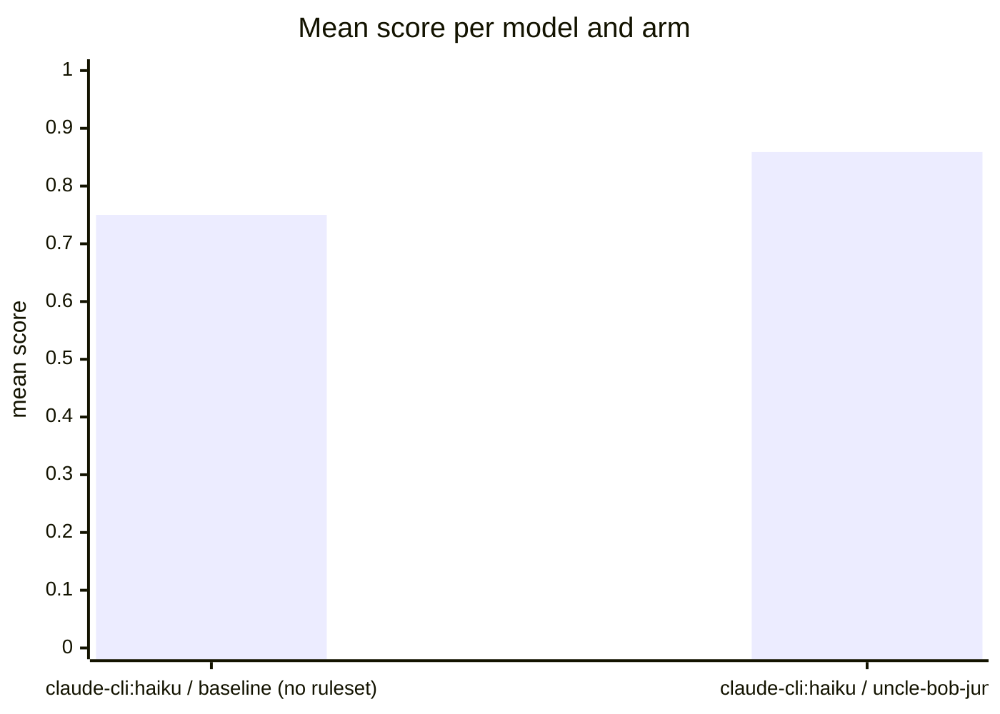

Run `eval-cRl-2026-08-29T17:04:39`: the same tasks and models, once bare (baseline) and once
with the uncle-bob-junior ruleset as system prompt, judged by
[habit-hooks](https://github.com/habit-hooks/habit-hooks) plus valid-code,
ships-tests, and correctness gates. Single-shot generations, so expect
run-to-run variance.

| Task | Arm | Score | Valid code | Habit-hooks | Ships tests | Correct | Oversized function |
|---|---|---:|:---:|:---:|:---:|:---:|---:|
| email | claude-cli:haiku · baseline (no ruleset) | 0.75 | **No** | Pass | **No** | Yes | 0 |
| email | claude-cli:haiku · uncle-bob-junior | 0.86 | Yes | **Fail** | Yes | **No** | 1 |
