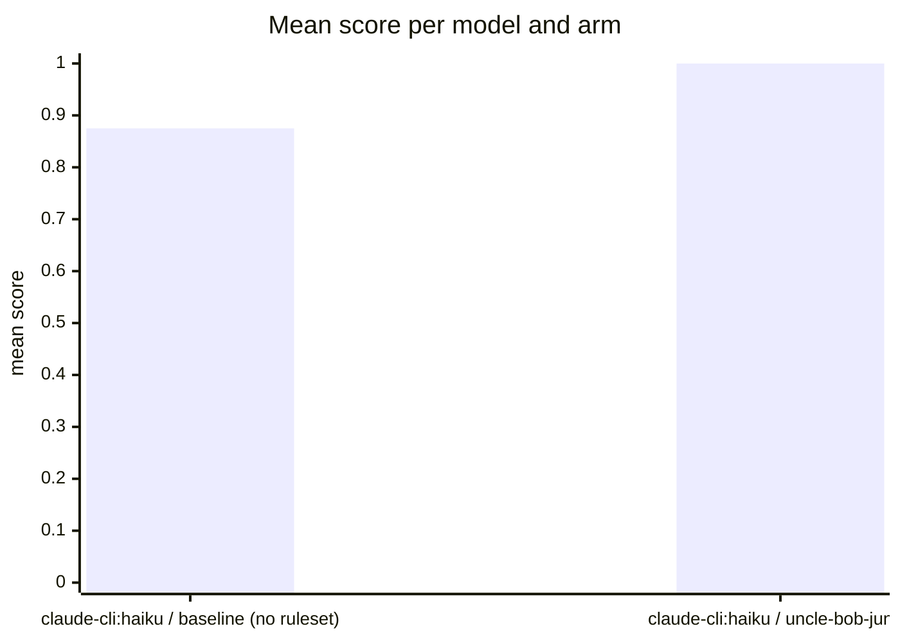

Run `eval-fVR-2026-08-29T13:22:40`: the same tasks and models, once bare (baseline) and once
with the uncle-bob-junior ruleset as system prompt, judged by
[habit-hooks](https://github.com/habit-hooks/habit-hooks) plus valid-code,
ships-tests, and correctness gates. Single-shot generations, so expect
run-to-run variance.

| Task | Arm | Score | Valid code | Habit-hooks | Ships tests | Correct |  |
|---|---|---:|:---:|:---:|:---:|:---:||
| email | claude-cli:haiku · baseline (no ruleset) | 0.88 | Yes | Pass | **No** | Yes |  |
| email | claude-cli:haiku · uncle-bob-junior | 1.00 | Yes | Pass | Yes | Yes |  |
