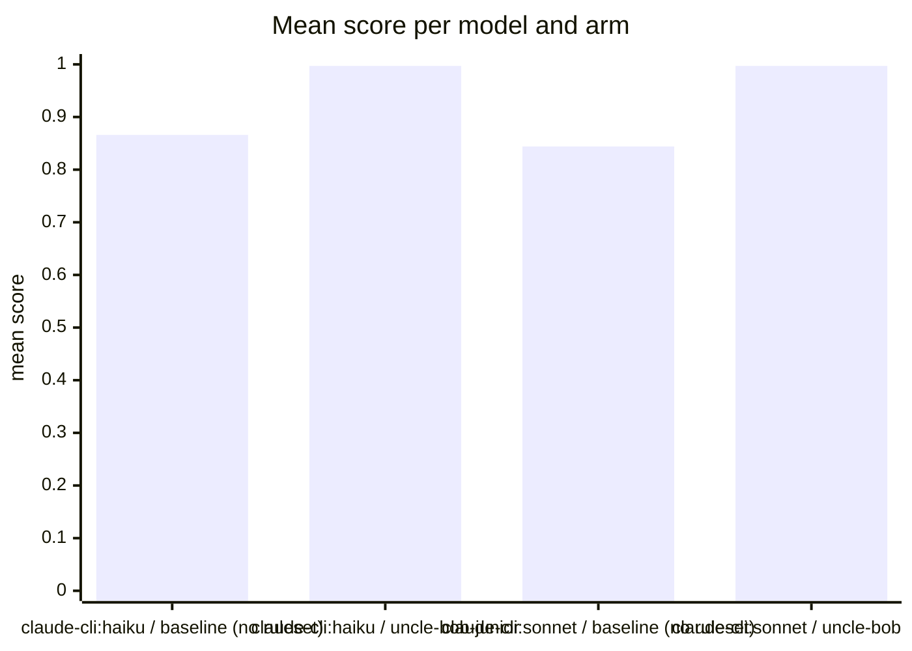

Run `eval-NYB-2026-08-29T13:59:24`: the same tasks and models, once bare (baseline) and once
with the uncle-bob-junior ruleset as system prompt, judged by
[habit-hooks](https://github.com/habit-hooks/habit-hooks) plus valid-code,
ships-tests, and correctness gates. Single-shot generations, so expect
run-to-run variance.

| Task | Arm | Score | Valid code | Habit-hooks | Ships tests | Correct | Oversized function | Too many parameters | High complexity | Unused variable |
|---|---|---:|:---:|:---:|:---:|:---:|---:|---:|---:|---:|
| csv | claude-cli:haiku · baseline (no ruleset) | 0.86 | Yes | **Fail** | **No** | Yes | 1 | 0 | 0 | 0 |
| csv | claude-cli:haiku · uncle-bob-junior | 0.98 | Yes | **Fail** | Yes | Yes | 1 | 0 | 0 | 0 |
| csv | claude-cli:sonnet · baseline (no ruleset) | 0.84 | Yes | **Fail** | **No** | Yes | 1 | 0 | 1 | 0 |
| csv | claude-cli:sonnet · uncle-bob-junior | 1.00 | Yes | Pass | Yes | Yes | 0 | 0 | 0 | 0 |
| email | claude-cli:haiku · baseline (no ruleset) | 0.88 | Yes | Pass | **No** | Yes | 0 | 0 | 0 | 0 |
| email | claude-cli:haiku · uncle-bob-junior | 1.00 | Yes | Pass | Yes | Yes | 0 | 0 | 0 | 0 |
| email | claude-cli:sonnet · baseline (no ruleset) | 0.88 | Yes | Pass | **No** | Yes | 0 | 0 | 0 | 0 |
| email | claude-cli:sonnet · uncle-bob-junior | 1.00 | Yes | Pass | Yes | Yes | 0 | 0 | 0 | 0 |
| order | claude-cli:haiku · baseline (no ruleset) | 0.86 | Yes | **Fail** | **No** | Yes | 1 | 0 | 0 | 0 |
| order | claude-cli:haiku · uncle-bob-junior | 1.00 | Yes | Pass | Yes | Yes | 0 | 0 | 0 | 0 |
| order | claude-cli:sonnet · baseline (no ruleset) | 0.83 | Yes | **Fail** | **No** | Yes | 1 | 1 | 1 | 0 |
| order | claude-cli:sonnet · uncle-bob-junior | 0.98 | Yes | **Fail** | Yes | Yes | 0 | 1 | 0 | 0 |
| ratelimit | claude-cli:haiku · baseline (no ruleset) | 0.86 | Yes | **Fail** | **No** | Yes | 1 | 0 | 0 | 0 |
| ratelimit | claude-cli:haiku · uncle-bob-junior | 1.00 | Yes | Pass | Yes | Yes | 0 | 0 | 0 | 0 |
| ratelimit | claude-cli:sonnet · baseline (no ruleset) | 0.84 | Yes | **Fail** | **No** | Yes | 1 | 1 | 0 | 0 |
| ratelimit | claude-cli:sonnet · uncle-bob-junior | 1.00 | Yes | Pass | Yes | Yes | 0 | 0 | 0 | 0 |
| retry | claude-cli:haiku · baseline (no ruleset) | 0.88 | Yes | Pass | **No** | Yes | 0 | 0 | 0 | 0 |
| retry | claude-cli:haiku · uncle-bob-junior | 1.00 | Yes | Pass | Yes | Yes | 0 | 0 | 0 | 0 |
| retry | claude-cli:sonnet · baseline (no ruleset) | 0.83 | Yes | **Fail** | **No** | Yes | 1 | 0 | 1 | 1 |
| retry | claude-cli:sonnet · uncle-bob-junior | 1.00 | Yes | Pass | Yes | Yes | 0 | 0 | 0 | 0 |
