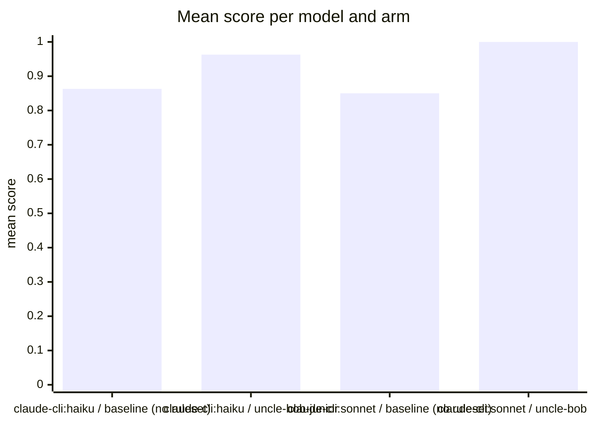

Run `eval-Pvn-2026-08-28T08:24:17`: the same tasks and models, once bare (baseline) and once
with the uncle-bob-junior ruleset as system prompt, judged by
[habit-hooks](https://github.com/habit-hooks/habit-hooks) plus valid-code,
ships-tests, and correctness gates. Single-shot generations, so expect
run-to-run variance.

## Mean score per model and arm

## Per task

| Task | Arm | Score | Valid code | Habit-hooks | Ships tests | Correct | Oversized function | Too many parameters | High complexity | Unused variable | Unused import |
|---|---|---:|:---:|:---:|:---:|:---:|---:|---:|---:|---:|---:|
| [csv](tasks/csv) | claude-cli&#58;haiku · baseline (no ruleset) | 0.84 | Yes | **Fail** | **No** | Yes | 1 | 0 | 0 | 0 | 1 |
| [csv](tasks/csv) | claude-cli&#58;haiku · uncle-bob-junior | 0.86 | Yes | **Fail** | **No** | Yes | 1 | 0 | 0 | 0 | 0 |
| [csv](tasks/csv) | claude-cli&#58;sonnet · baseline (no ruleset) | 0.86 | Yes | **Fail** | **No** | Yes | 1 | 0 | 0 | 0 | 0 |
| [csv](tasks/csv) | claude-cli&#58;sonnet · uncle-bob-junior | 1.00 | Yes | Pass | Yes | Yes | 0 | 0 | 0 | 0 | 0 |
| [email](tasks/email) | claude-cli&#58;haiku · baseline (no ruleset) | 0.88 | Yes | Pass | **No** | Yes | 0 | 0 | 0 | 0 | 0 |
| [email](tasks/email) | claude-cli&#58;haiku · uncle-bob-junior | 1.00 | Yes | Pass | Yes | Yes | 0 | 0 | 0 | 0 | 0 |
| [email](tasks/email) | claude-cli&#58;sonnet · baseline (no ruleset) | 0.88 | Yes | Pass | **No** | Yes | 0 | 0 | 0 | 0 | 0 |
| [email](tasks/email) | claude-cli&#58;sonnet · uncle-bob-junior | 1.00 | Yes | Pass | Yes | Yes | 0 | 0 | 0 | 0 | 0 |
| [order](tasks/order) | claude-cli&#58;haiku · baseline (no ruleset) | 0.84 | Yes | **Fail** | **No** | Yes | 1 | 0 | 1 | 0 | 0 |
| [order](tasks/order) | claude-cli&#58;haiku · uncle-bob-junior | 0.97 | Yes | **Fail** | Yes | Yes | 1 | 1 | 0 | 0 | 0 |
| [order](tasks/order) | claude-cli&#58;sonnet · baseline (no ruleset) | 0.80 | Yes | **Fail** | **No** | Yes | 3 | 1 | 1 | 0 | 0 |
| [order](tasks/order) | claude-cli&#58;sonnet · uncle-bob-junior | 1.00 | Yes | Pass | Yes | Yes | 0 | 0 | 0 | 0 | 0 |
| [ratelimit](tasks/ratelimit) | claude-cli&#58;haiku · baseline (no ruleset) | 0.88 | Yes | Pass | **No** | Yes | 0 | 0 | 0 | 0 | 0 |
| [ratelimit](tasks/ratelimit) | claude-cli&#58;haiku · uncle-bob-junior | 0.98 | Yes | **Fail** | Yes | Yes | 0 | 0 | 0 | 1 | 0 |
| [ratelimit](tasks/ratelimit) | claude-cli&#58;sonnet · baseline (no ruleset) | 0.88 | Yes | Pass | **No** | Yes | 0 | 0 | 0 | 0 | 0 |
| [ratelimit](tasks/ratelimit) | claude-cli&#58;sonnet · uncle-bob-junior | 1.00 | Yes | Pass | Yes | Yes | 0 | 0 | 0 | 0 | 0 |
| [retry](tasks/retry) | claude-cli&#58;haiku · baseline (no ruleset) | 0.88 | Yes | Pass | **No** | Yes | 0 | 0 | 0 | 0 | 0 |
| [retry](tasks/retry) | claude-cli&#58;haiku · uncle-bob-junior | 1.00 | Yes | Pass | Yes | Yes | 0 | 0 | 0 | 0 | 0 |
| [retry](tasks/retry) | claude-cli&#58;sonnet · baseline (no ruleset) | 0.84 | Yes | **Fail** | **No** | Yes | 1 | 0 | 1 | 0 | 0 |
| [retry](tasks/retry) | claude-cli&#58;sonnet · uncle-bob-junior | 1.00 | Yes | Pass | Yes | Yes | 0 | 0 | 0 | 0 | 0 |

The generated code per task lives under [Tasks](tasks).
